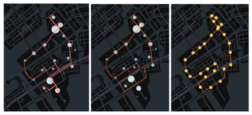

# Data-Driven Design for Autonomous Bus in Tokyo Bay
This is a section of the whole study of Data Driven Design for Future Transportation System in Tokyo Bay project.
## Introduction
Japan's urban landscape is evolving rapidly, and the Tokyo Bay Area—particularly districts such as Toyosu, Shinonome, and Ariake in Koto Ward—illustrates both the challenges and opportunities of modern transit demands. While Japan's aging population (with nearly 30% of residents aged 65+ as of 2025[1]) underscores the need for accessible mobility solutions, urban residents of all ages require a transit system that is efficient, inclusive, and flexible.

*Figure 1: Population by Age Group (in Millions) and Percentage of Population Age 65 or Older*

Existing transit options, such as the Yurikamome line, provide valuable connectivity but often fall short in offering fine-grained, intra-area mobility that supports short trips—whether it be heading to hospitals, markets, or workplace clusters. In response, this project proposes a resilient, sustainable transportation system designed to serve the diverse needs of the community. By leveraging autonomous electric buses, the system aims to enhance accessibility, decrease car dependency, and build in the flexibility necessary to support elderly passengers without compromising service for younger residents.

## Objective
The objective of this module was to design an autonomous electric bus system serving the neighborhoods of Toyosu, Shinonome, and Ariake, with a focus on enhancing intra-area mobility for all residents—particularly in accommodating the needs of an aging population. The design process aimed to:
  1. identify high-demand bus stop locations using GPS-based origin-destination (O-D) data
  2. optimize a route that efficiently connects these stops
  3. develop a demand-responsive timetable aligned with observed travel patterns
  4. propose a custom electric bus solution to support both environmental sustainability and practical operability
The system is designed with flexibility for future enhancements to ensure long-term resilience.

## Data & Processing
The dataset used in this study consisted of GPS-based mobility data capturing the movement of individuals across the Tokyo metropolitan area over a 7-day period from May 21 to May 27, 2023. Each record included geolocation points (latitude and longitude), timestamps, and inferred modes of transportation such as “in_vehicle,” “on_foot,” and “on_bicycle.”
For this module, the data was filtered to include only trips that both originated and ended within the Toyosu area (35.62°–35.67°N, 139.77°–139.83°E), isolating intra-area motorized travel. Although the full dataset opens opportunities for future analysis of trips entering or exiting the area, this module focuses exclusively on internal mobility.

The preprocessing steps included:
  - Filtering transportation mode to retain only "in_vehicle" trips.
  - Identifying trip endpoints using the first and last recorded coordinates of each trip.
  - Transforming timestamps into two temporal features: day of the week and hour of the day (0–23), enabling spatiotemporal aggregation of passenger flows.
  - This cleaned and structured dataset served as the foundation for identifying high-demand bus stop locations and developing a time-sensitive routing and scheduling model.

## Methodology
The methodology followed a data-driven approach:
1. Stop Identification: Origin-destination points derived from GPS data were clustered using K-means to identify high-density candidate stops within Toyosu, Shinonome, and Ariake. To ensure inclusivity, additional stops were added near elderly-relevant points of interest (e.g., Showa University Hospital).

2. Route Optimization: The street network was extracted using OSMnx, and the optimal route connecting the selected stops was computed using NetworkX’s approximate Travelling Salesman Problem (TSP) solver. The expected result was a closed-loop route, designed to minimize travel time while covering major demand clusters, with an estimated loop duration of ~40 minutes. The result from TSP will be refined if needed.

3. Scheduling: Passenger demand patterns—extracted from the processed heatmap data—were used to define service frequency. The schedule adapts based on hourly passenger volumes:
  - 15-minute frequency for peak demand (>1,000 passengers/hour),
  - 20–30 minutes for moderate demand (500–1,000),
  - 60 minutes for low demand (<250).
This approach ensures responsiveness to temporal ridership fluctuations.

4. Bus Specification: A custom electric autonomous bus was specified to meet sustainability and operational needs based on the results from previous steps.
The entire process was carried out in Python using several packages, including Scikit-learn for KMeans clustering, Python-TSP for solving the Traveling Salesman Problem, and OSMnx and NetworkX for network analysis. The Jupyter Notebooks developed for this analysis are available in this GitHub repository: https://github.com/bosserz/ddd-transport-tokyo-bay.git.

## Results
### Stop Identification
- A total of 25 stops were selected through K-means clustering of O-D points, supplemented with stops near key elderly-relevant POIs, ensuring connectivity for residents of all ages.
- The selected stops effectively link major destinations, including Toyosu Station, Shinonome residential areas, and Ariake Station.

*Figure 2: Density of Origin-Destination from GPS Data (left), 25 Candidate Bus Stops from K-Mean Clustering (right)*

### Route Optimization
- The result from the Traveling Salesman Solver is shown in Figure 3 (left). The result shows some vacillation, then the refinement is done and the result is shown in the middle figure of Figure 3.
- The final route forms an 11.5 km closed loop efficiently connecting all 25 stops within Toyosu, Shinonome, and Ariake.
- This route enables comprehensive intra-area coverage while minimizing overall travel time.
- The proposed 25 bus stops location according to the refined bus route are shown in Figure 3 (right).

*Figure 3: Bus Route from TSP algorithm (left), Refined Bus Route to remove vacillation (middle), Proposed Bus Stop based on the refined bus route (right)*

### Scheduling
- Service frequencies were tailored to match observed passenger demand:
    - 15-minute intervals during peak hours (e.g., 8:00 AM weekdays, with up to 1,525 passengers).
    - 20–30 minutes during moderate demand periods (500–1,000 passengers).
    - 60-minute intervals during off-peak times (<250 passengers).
- The schedule ensures sufficient capacity, particularly accommodating elderly riders during peak demand periods while optimizing resources during lower-demand hours.

*Figure 4: Passenger Demand & Proposed Bus Frequency*

In Figure 4, the passenger demand and bus frequency analysis reveals distinct temporal patterns between weekdays and weekends. On weekdays, demand surges rapidly from 6 AM and peaks around 8 AM with approximately 1,525 passengers, driven primarily by commuter traffic. To accommodate this peak, the system operates buses at 15-minute intervals. As demand stabilizes between 800–1,100 passengers from mid-morning to late afternoon, frequency is adjusted to 20–30 minutes, before tapering to 60-minute intervals during late evening when ridership drops below 250.

In contrast, weekend demand peaks later and is more sustained through the day, reaching around 1,300 passengers at 11 AM and remaining elevated until late afternoon. Bus frequency follows suit, offering 15-minute intervals during peak hours and scaling back to 30–60 minutes as demand decreases. This demand-responsive scheduling approach ensures that bus availability aligns with passenger needs, optimizing both rider experience and operational efficiency.

### Bus Specification
- System operation during peak hours requires three electric buses, each with a 40-passenger capacity and able to complete the 40-minute loop efficiently.
- Each bus is equipped with a 350 kWh battery, supporting a 230 km daily range with both overnight and mid-day charging.
- A dedicated hub at Toyosu Station is equipped with three 150 kW fast chargers to support continuous, reliable operation.

### Future Enhancements
- To ensure long-term system resilience, further analysis is proposed, including flood risk integration into route planning.
- Preliminary cost estimation suggests an implementation budget of approximately $3.4 million.

## Conclusion
This study demonstrates a data-driven approach to designing an autonomous electric bus system that enhances local mobility in Toyosu, Shinonome, and Ariake. By leveraging GPS mobility data, the study identified high-demand stop locations and optimized a 25-stop, 11.5 km loop route that addresses intra-area transportation needs. A demand-responsive timetable was developed to ensure service frequency aligns with passenger patterns across weekdays and weekends, balancing accessibility and operational efficiency.

The system’s integration of sustainable electric buses, supported by a centralized charging hub at Toyosu Station, offers a practical and future-ready solution to reduce car dependency while remaining adaptable to the needs of an aging population.
